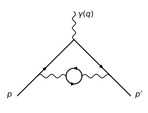
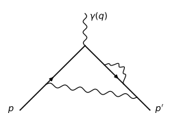
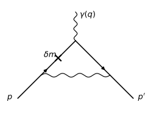
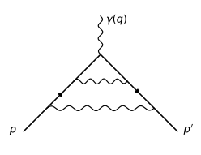
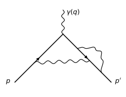
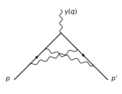
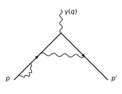

# Magnetic moment of an electron (NLO)

In this section we derive the next-to-leading-order (NLO) order-$\alpha^2$
correction to the magnetic moment of an electron. This has been first
attempted in 1950 by Karplus and Kroll, and first computed correctly in 1957
by Petermann and Sommerfield.

See for example
[hep-ph/9410248](http://arxiv.org/abs/hep-ph/9410248) for the expression
for $A_2$:

$$A_2 = \frac{197}{144} + \frac{3}{4} \zeta\left(3\right) - \frac{1}{2}
    \pi^{2} \operatorname{log}\left(2\right) + \frac{1}{12} \pi^{2} =$$

$$= -0.328478965579\dots$$

Code:

    >>> from sympy import zeta, S, log
    >>> A_2 = S(197)/144 + zeta(2)/2 + 3*zeta(3)/4 - 3*zeta(2) * log(2)
    >>> A_2.n()
    -0.328478965579194

## Plan of the calculation

**Status: work in progress.** Each contribution below gets its own section:
the diagram, whether/how it must be renormalized, the computation strategy,
the known analytic value, and (once done) our own SymPy derivation
cross-checked numerically in Fortran. Currently done: LO massive-photon
kernel, diagram IIe. Everything else is planned.

As in the LO section, the anomalous moment is the on-shell form factor

$$a_e = F_2(0),$$

now evaluated to order $\alpha^2$: we must compute the two-loop
(fourth-order in $e$) contributions to the vertex function
$\Gamma^\mu(p', p)$, project out $F_2$, and take $q^2 \to 0$.

### Papers (all in this repo)

* `twoloop.pdf` — R. Karplus and N. M. Kroll, Phys. Rev. 77 (1950) 536
  ("KK"). The first attempt; defines the diagram classification I, IIa–IIf
  used by all the 1950s papers (their Fig. 1). Their values for diagrams
  I and IIc were wrong.
* `petermann1957.pdf` — A. Petermann, Helv. Phys. Acta 30 (1957) 407.
  The full analytic evaluation of the five independent contributions;
  our per-diagram reference values (eqs. (1)–(6)) are from this paper.
* `petermann1958.pdf` — A. Petermann, Nucl. Phys. 5 (1958) 677.
  Rigorous upper/lower bounds proving KK's $\mu_{\mathrm{IIc}}$ wrong;
  gives the complete auxiliary-variable integrands for IIc
  (his eqs. (2.1)–(2.4)) — our reproduction target for that diagram.
* `sommerfield1957.pdf` — C. M. Sommerfield, Phys. Rev. 107 (1957) 328;
  `sommerfield1958.pdf` — Ann. Phys. 5 (1958) 26. Independent calculation
  by Schwinger's mass-operator method, confirming Petermann's total.
* `laporta1991.pdf`, `laporta1993.pdf`, `laporta1994.pdf` — S. Laporta
  (with E. Remiddi in 1991): analytic values of sixth-order (three-loop)
  graphs. Not needed for $A_2$; kept for the later $A_3$ project.

### The Karplus–Kroll diagram classification

KK's Fig. 1 groups the fourth-order diagrams for electron scattering off an
external field into five classes:

* **Class I** — the crossed-ladder ("irreducible") vertex diagram.
* **Class II** (a–f) — the "reducible" two-loop vertex diagrams: they
  contain a one-loop subdiagram (vertex part, self-energy, or vacuum
  polarization) inserted into the LO vertex diagram.
* **Class III** — vacuum-polarization corrections *to the external field
  line* (including light-by-light-type blobs attached to the external
  potential). These modify the external potential, not the electron's
  moment: no contribution here. (The light-by-light *vertex* graphs that do
  contribute to $a_e$ first appear at sixth order — see `laporta1991.pdf`.)
* **Class IV** — diagrams reducible to a photon self-energy correction of
  the *scattered wave*: pure charge renormalization, no moment
  contribution.
* **Class V** — electron-loop tadpole-like diagrams: the two orientations
  cancel exactly by Furry's theorem.

So only class I and class II contribute. Within class II, IIb and IIf are
self-energy corrections on the *external* electron legs — pure mass/field
renormalization with no moment contribution (see below). The mirror images
(reflection through the external vertex) of IIc and IId are not drawn by KK;
their contribution is included by doubling. That leaves **five independent
contributions**: I, IIa, IIc, IId, IIe.

### Reference values (Petermann 1957)

In units of $\alpha^2/\pi^2$, with the photon-mass IR regulator
$\lambda$ (`petermann1957.pdf`, eqs. (1)–(6)):

$$\mu_\mathrm{I} = \frac16 + \frac{13}{36}\pi^2 + \frac54\zeta(3)
    - \frac56\pi^2\log 2 = -0.467645\ldots$$

$$\mu_\mathrm{IIa} = \frac{11}{48} + \frac{\pi^2}{18} = +0.777478\ldots$$

$$\mu_\mathrm{IIc} = -\frac{67}{24} + \frac{\pi^2}{18} - \frac12\zeta(3)
    + \frac13\pi^2\log 2 - \frac12\log\frac{\lambda^2}{m^2}
    = -0.564021\ldots - \frac12\log\frac{\lambda^2}{m^2}$$

$$\mu_\mathrm{IId} = \frac{11}{24} - \frac{\pi^2}{18}
    + \frac12\log\frac{\lambda^2}{m^2}
    = -0.089978\ldots + \frac12\log\frac{\lambda^2}{m^2}$$

$$\mu_\mathrm{IIe} = \frac{119}{36} - \frac{\pi^2}{3} = +0.015687\ldots$$

The infrared logarithms cancel between IIc and IId, and the sum is exactly
$A_2$:

    >>> from sympy import Rational, pi, zeta, log, symbols, simplify, expand
    >>> L = symbols("L")   # L = log(lambda^2/m^2)
    >>> mu_I   = Rational(1,6) + Rational(13,36)*pi**2 + Rational(5,4)*zeta(3) \
    ...          - Rational(5,6)*pi**2*log(2)
    >>> mu_IIa = Rational(11,48) + pi**2/18
    >>> mu_IIc = -Rational(67,24) + pi**2/18 - zeta(3)/2 + pi**2*log(2)/3 - L/2
    >>> mu_IId = Rational(11,24) - pi**2/18 + L/2
    >>> mu_IIe = Rational(119,36) - pi**2/3
    >>> expand(mu_I + mu_IIa + mu_IIc + mu_IId + mu_IIe)
    -pi**2*log(2)/2 + pi**2/12 + 3*zeta(3)/4 + 197/144

For the record, KK's two errors: their $\mu_\mathrm{I}$ was too low by
$\frac{1}{32}$, and their $\mu_\mathrm{IIc} = -3.18$ was too low by
$\frac{32}{3} - \frac{61}{8}\pi^2 + \frac{17}{2}\pi^2\log 2
- \frac{109}{4}\zeta(3) = 2.614$, which is how they arrived at the wrong
total $-2.973$.

**Caveat on per-diagram comparisons**: the split of $A_2$ into the five
$\mu$'s is scheme-dependent — it depends on how the UV subtractions
(mass, vertex, charge renormalization) are apportioned among the diagrams,
and on the IR regulator. To reproduce Petermann's *individual* numbers we
must follow the KK subtraction conventions (they renormalize each reducible
diagram by subtracting the corresponding lower-order renormalization part,
which is why e.g. the ladder IIa comes out UV- and IR-finite). Only the
total is scheme-independent.

### Conventions, regulators, renormalization

We keep the conventions of the LO section (Peskin–Schroeder-style, metric
$(+,-,-,-)$), with:

* **IR**: photon mass $\lambda$ (as in KK/Petermann).
* **UV**: Pauli–Villars, to match the 1950s papers. (A dimensional-
  regularization pass can be added later as an independent check.)
* electron mass $m = 1$ in all integrals below.

Note that KK/Petermann use the old "Pauli metric" conventions
($i\gamma p + m$ propagators), so a translation is needed when comparing
intermediate formulas.

Renormalization structure at this order:

* **Mass renormalization**: the self-energy subgraph in IId is UV
  divergent; the on-shell counterterm $\delta m$ (order $\alpha$) is
  inserted into the internal electron propagators of the LO vertex and
  subtracted together with IId ("reduced diagram" bookkeeping of KK).
* **Vertex renormalization cross term**: IIa and IIc contain a divergent
  one-loop vertex subgraph. As in the LO section we renormalize so that
  $F_1(0) = 1$ to all orders; writing the unrenormalized
  $F_1(0) = 1 + \delta F_1(0) + O(\alpha^2)$, the vertex rescaling by
  $Z_1 = 1 - \delta F_1(0) + \dots$ produces the cross term

  $$-\,\delta F_1(0)\, F_2^{(2)}(0) = -\,\delta F_1(0)\,\frac{\alpha}{2\pi},$$

  whose UV part cancels the vertex subdivergences of IIa + IIc and whose
  $\log\lambda$ part participates in the IR cancellations.
* **Wavefunction renormalization** $Z_2$ of the external legs: cancels
  against $Z_1$ by the Ward identity ($Z_1 = Z_2$); equivalently, diagrams
  IIb/IIf plus the external-leg counterterms give zero moment contribution.
* **Charge renormalization**: contained in using the once-subtracted
  vacuum polarization $\hat\Pi(q^2)$ (with $\hat\Pi(0)=0$) in diagram IIe,
  with $\alpha$ the physical fine-structure constant.

Master strategy for each diagram:

1. Write the amplitude from the Feynman rules (as in the LO section).
2. Project out $F_2(0)$ (magnetic projector / trace technique, so the
   whole computation reduces to Dirac traces and scalar integrals — done
   in SymPy).
3. Combine denominators with Feynman parameters, do both loop-momentum
   integrations, leaving a multi-dimensional parametric integral.
4. Evaluate: **numerically first** (Fortran, Gauss–Legendre / adaptive
   quadrature, compiled with
   `flang -O3 -march=native -ffast-math`), then **analytically** in SymPy
   by sequential one-variable integration in a well-chosen order (this is
   where $\zeta(3)$, $\pi^2\log 2$, $\pi^2$ arise, exactly as in
   Petermann's hand calculation).

Tooling (see `pixi.toml` tasks): `pixi run figures` regenerates the
diagram SVGs (`code/feynman_diagrams.py`); `pixi run lo-sympy`,
`pixi run iie-sympy` run the SymPy derivations (`code/g2_lo.py`,
`code/g2_iie.py`); `pixi run iie-fortran` compiles and runs the Fortran
check (`code/g2_iie.f90`); `pixi run g2-nlo` runs everything.

A SymPy practicality discovered on the way, used throughout: definite
`integrate()` with a free parameter in the integrand is slow and sometimes
wrong (branch issues) — e.g. it returns $\frac12 - r$ for the massive
photon kernel $K$ below, which is false. We therefore rationalize all
square roots by substitution, take *indefinite* antiderivatives of
partial-fractioned integrands, and evaluate the endpoint limits ourselves,
checking every intermediate result numerically.

## Stage 0: LO vertex with a massive photon

The pipeline is validated on the LO diagram, generalized to a photon of
mass $\lambda$ (needed both as the IR regulator and as the spectral mass
in diagram IIe). Repeating the LO derivation with
$\Delta = (1-z)^2 m^2 - q^2 xy + z\lambda^2$ gives, with $t = \lambda^2/m^2$:

$$F_2(0;\lambda) = \frac{\alpha}{\pi} K(t), \qquad
  K(t) = \int_0^1 \frac{z(1-z)^2}{(1-z)^2 + z t}\, \mathrm{d} z, \qquad
  K(0) = \frac12.$$

For $t > 4$ (the spectral region needed below) the denominator factors
rationally under the substitution

$$t = \frac{(1+y)^2}{y}, \quad 0 < y \le 1: \qquad
  (1-z)^2 + z t = \frac{(z+y)(zy+1)}{y}.$$

Running `pixi run lo-sympy` (`code/g2_lo.py`):

    K(0) = 1/2  => a_e = alpha/(2 pi)
    K(y) = (-y**2*(y - 1)*(2*y + 3) - 2*y*(y - 1)
            + log(((y + 1)/y)**(2*y**4*(y + 1))*(y + 1)**(-2*y - 2)))
           /(2*y**2*(y - 1))
    K(t=8) direct  = 0.02728067078038736724734729
    K(t=8) closed  = 0.02728067078038736724734729
    OK: closed form matches numeric integration

## Diagram IIe: vacuum polarization insertion — DONE

**Topology**: the LO vertex diagram with the internal photon corrected by
an electron loop.

**Renormalization**: the electron loop $\Pi^{\mu\nu}$ is UV divergent; the
once-subtracted $\hat\Pi$ ($\hat\Pi(0) = 0$, i.e. on-shell charge
renormalization) makes the diagram finite. It is also IR finite — no
$\log\lambda$ — so it is a well-defined number all by itself.

**Method** (dispersion relation): the renormalized VP gives the spectral
representation of the dressed photon propagator,

$$\frac{1}{k^2} \to \frac{1}{k^2}
   + \int_{4m^2}^\infty \mathrm{d} t\, \frac{\rho(t)}{k^2 - t}, \qquad
  \rho(t) = \frac{\alpha}{3\pi t}\left(1 + \frac{2m^2}{t}\right)
  \sqrt{1 - \frac{4m^2}{t}},$$

i.e. diagram IIe is the LO diagram with a *massive* photon folded with
$\rho$:

$$\mu_\mathrm{IIe}
   = \int_{4}^\infty \mathrm{d} t\, \frac{1}{3t}\left(1+\frac2t\right)
     \sqrt{1-\frac4t}\; K(t) \qquad \text{(units } \alpha^2/\pi^2,\ m=1).$$

With $t = (1+y)^2/y$ everything rationalizes
($\sqrt{t(t-4)} = (1-y^2)/y$, $|\mathrm{d}t/\mathrm{d}y| = (1-y^2)/y^2$):

$$\mu_\mathrm{IIe} = \int_0^1 \mathrm{d} y \int_0^1 \mathrm{d} z\,
   \frac{(y^2+4y+1)(1-y)^2}{3\,y\,(1+y)^4}\;
   \frac{z(1-z)^2\, y}{(z+y)(zy+1)}.$$

The $y$-integration (rational) is done first; the remaining $z$-integrand
is of the form $A(z)\log z + B(z)$ with rational $A, B$, whose integral
produces dilogarithms at unit argument, i.e. $\pi^2$.

**Result** — `pixi run iie-sympy` (`code/g2_iie.py`):

    after y-integration:
      I(z) = z*(-5*z**3 + 27*z**2 - 27*z + log(z**(3*z**3 - 9*z**2 - 9*z + 3)) + 5)
             /(9*(z**3 - 3*z**2 + 3*z - 1))
    mu_IIe = 119/36 - pi**2/3
           = 0.015687421859102682611
    OK: mu_IIe = 119/36 - pi^2/3  (Petermann 1957, eq. (5))

Numeric check — `pixi run iie-fortran` (`code/g2_iie.f90`, independent
128-point Gauss–Legendre quadrature in the original $t$-form variables):

    mu_IIe (numeric)      =    0.015687421859103
    119/36 - pi^2/3       =    0.015687421859103
    difference            =   2.98E-16

$$\boxed{\mu_\mathrm{IIe} = \frac{119}{36} - \frac{\pi^2}{3}}$$

in agreement with `petermann1957.pdf`, eq. (5).

## Diagram IId: self-energy insertion on the internal electron line — TODO

**Topology**: the LO vertex diagram with the one-loop electron self-energy
$\Sigma(p)$ inserted on one internal electron propagator. The mirror
diagram contributes equally; $\mu_\mathrm{IId}$ includes both.

**Renormalization**: $\Sigma$ is UV divergent; use the on-shell-subtracted

$$\Sigma_R(p) = \Sigma(p) - \delta m - (\not p - m)
   \left.\frac{\partial\Sigma}{\partial\not p}\right|_{\not p = m},$$

which is equivalent to adding the $\delta m$-insertion counterterm diagram

and the $\delta Z_2$ piece. The on-shell subtraction is IR sensitive:
$\mu_\mathrm{IId}$ keeps a $+\frac12\log(\lambda^2/m^2)$ that cancels
against IIc.

**Plan**: write $\Sigma_R$ in one-parameter Feynman form as a spectral
integral over an effective mass on the internal line; the outer loop is
then an LO-type integral again (same trick as IIe). Expect a 3–4-fold
parametric integral, integrable sequentially.
**Target**: $\mu_\mathrm{IId} = \frac{11}{24} - \frac{\pi^2}{18}
+ \frac12\log\frac{\lambda^2}{m^2}$.

## Diagram IIa: ladder (vertex part at the external vertex) — TODO

**Topology**: both photons span the external vertex, nested: the inner
photon is a one-loop vertex correction at the external-field vertex.

**Renormalization**: the inner vertex subgraph is log-divergent; in the KK
scheme one subtracts the corresponding second-order renormalization part
(the $\delta F_1(0)\,\gamma^\mu$ counterterm) *within the diagram*, which
is what makes their $\mu_\mathrm{IIa}$ UV finite and even IR finite.

**Plan**: compute the renormalized inner vertex $\Gamma^\mu - \gamma^\mu
\delta F_1(0)$ with its photon legs off shell, keeping Feynman parameters;
insert into the outer LO-type loop. This and IIc are the genuinely
hard two-loop parametric integrals (4–5 parameters).
**Target**: $\mu_\mathrm{IIa} = \frac{11}{48} + \frac{\pi^2}{18}$.

## Diagram IIc: corner (vertex part at an internal vertex) — TODO

**Topology**: the outer photon spans the external vertex; a one-loop
vertex-correction subgraph sits at one of its two internal attachment
points. Mirror included by doubling.

**Renormalization**: inner vertex subgraph log-divergent, subtracted as in
IIa. IR divergent: carries $-\frac12\log(\lambda^2/m^2)$, cancelling IId.

**This is the diagram Karplus–Kroll got wrong** ($-3.18$ instead of
$-0.564 - \frac12\log\frac{\lambda^2}{m^2}$), and the one worked out in
detail in `petermann1958.pdf` — our reproduction target:

* his eq. (2.1)–(2.2): the amplitude after Dirac algebra, split into terms
  $A_1, A_2, A_3, B, C, D, E, F, H, J$, with the two inner Feynman
  parameters $u, v$ already introduced;
* his eq. (2.3)–(2.4): each term's contribution to $\mu_\mathrm{IIc}$ as a
  4–6-fold integral over $u,v,t,w,z,x \in [0,1]$ (note
  $\mu(A_3) = \mu(C) = 0$, and the IR log lives entirely in the $H$ term);
* his section 3: the rigorous-bound technique demonstrated on
  $\mu(A_1) > 2.30$ (exact value 2.60, per the footnote);
* his eqs. (3.13), (4.1): bounds summing to $\mu_\mathrm{IIc} \ge -1.55$,
  later refined to $-0.49 \ge \mu_\mathrm{IIc} \ge -0.71$.

**Plan**:

1. Transcribe the (2.3)–(2.4) integrands into Fortran (the scan's OCR is
   noisy — the formulas must be re-checked against a re-derivation);
   verify $\mu(A_1) \approx 2.60$ and that the total lands in
   $[-0.71, -0.49]$.
2. Reproduce his section-3 elementary bounds exactly in SymPy (e.g. his
   numeric $4.42$ in eq. (3.7) should be an exact $\log 2$/$\pi^2$
   combination).
3. Re-derive the integrands from our own Feynman rules + $F_2$ projector
   and check them against his, then evaluate analytically by sequential
   integration.

**Target**: $\mu_\mathrm{IIc} = -\frac{67}{24} + \frac{\pi^2}{18}
- \frac12\zeta(3) + \frac13\pi^2\log 2 - \frac12\log\frac{\lambda^2}{m^2}$.

## Diagram I: crossed ladder — TODO

**Topology**: both photons span the external vertex and cross. This is
KK's only "irreducible" diagram: it contains no one-loop subdiagram, so
**no UV subtraction is needed** — its $F_2$ projection is UV finite as it
stands. In the KK scheme it is IR finite too (no $\log\lambda$ in
$\mu_\mathrm{I}$).

**Plan**: direct two-loop computation: Dirac traces with the $F_2$
projector, two loop integrations, ~5-fold Feynman-parameter integral,
sequential analytic integration. Together with IIa/IIc this is where
$\zeta(3)$ and $\pi^2\log 2$ appear. KK's value was slightly wrong (by
$\frac1{32}$) even here, caught only by Petermann's analytic evaluation
(footnote in `petermann1958.pdf`).
**Target**: $\mu_\mathrm{I} = \frac16 + \frac{13}{36}\pi^2
+ \frac54\zeta(3) - \frac56\pi^2\log 2$.

## Diagrams IIb, IIf: external-leg self-energies — no contribution

Self-energy corrections on the external electron legs. After on-shell mass
renormalization and LSZ amputation (wavefunction renormalization $Z_2$,
which cancels against $Z_1$ by the Ward identity), these diagrams
contribute only to the overall normalization of the vertex, i.e. to
$F_1(0)$, not to $F_2(0)$. KK handle this by explicit cancellation between
IIb/IIf and their renormalization counterterms.

## Assembly and checks

1. Sum the five contributions; verify the $\log\lambda$ cancellation
   between IIc and IId symbolically.
2. Verify the total equals
   $A_2 = \frac{197}{144} + \frac{\pi^2}{12} + \frac34\zeta(3)
   - \frac12\pi^2\log 2$ (already verified above for Petermann's values;
   must hold for our own derived ones).
3. Numeric grand total in Fortran as an end-to-end sanity check.

## Suggested order of work

1. ~~Stage 0: LO pipeline + massive-photon kernel~~ — **done**.
2. ~~Diagram IIe~~ — **done** (SymPy exact + Fortran numeric).
3. Diagram IId + $\delta m$ counterterm (first real renormalization;
   spectral-insertion method).
4. Diagram IIc via Petermann 1958 (Fortran numerics of his integrands,
   bounds, then analytic).
5. Diagram IIa (same machinery as IIc).
6. Diagram I (direct two-loop; no renormalization).
7. Assembly, IR-cancellation check, final $A_2$.
